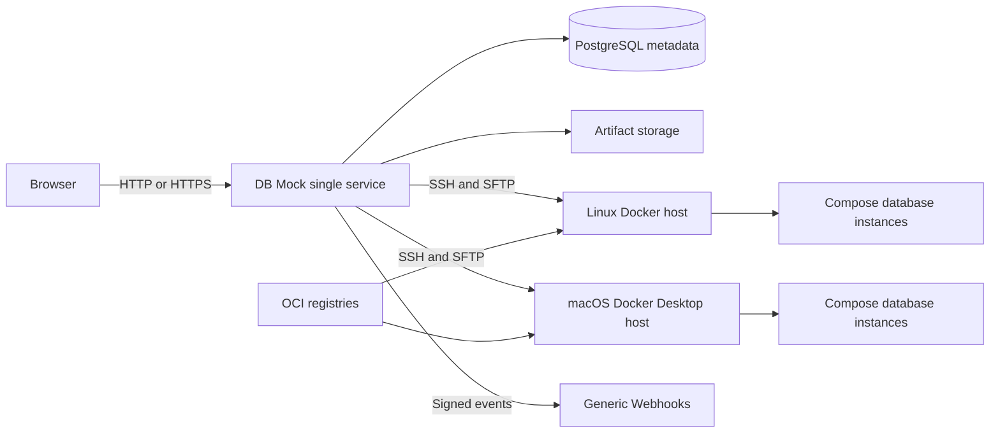
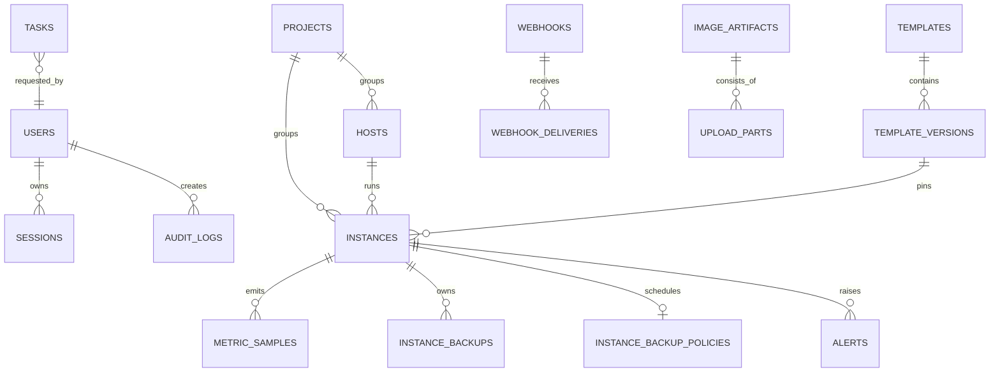
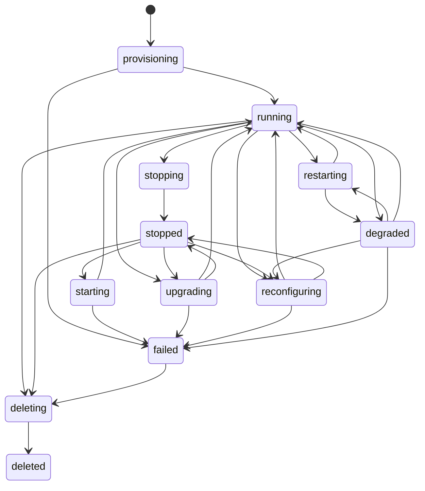

# DB Mock 技术架构

## 1. 总览



应用采用模块化单体。一个 Go 进程提供页面、JSON API、会话、任务调度、监控采集、
Webhook 和 SSH 编排。React 构建产物通过 `go:embed` 编入同一个二进制。

## 2. 技术选型

- Go：HTTP、任务、加密、SSH/SFTP、Compose 编排。
- React + TypeScript + Vite + Ant Design：管理页面。
- PostgreSQL：事务元数据、任务、审计和短期指标历史。
- Docker Compose v2：控制平台部署及远程数据库实例运行。
- SSH/SFTP：无代理远程执行和文件传输。

不引入 Redis、消息队列、Nginx、Prometheus 或常驻远程 Agent，以符合 10 主机、50 实例
的规模并降低离线部署复杂度。

### 仓库边界

```text
backend/            Go 模块、cmd、internal、迁移和 web/embed
frontend/           React/Vite 源码与测试
deploy/             compose.yaml、docker/Dockerfile、环境模板和 TLS
scripts/            安装、升级、离线包和 CI 辅助脚本
docs/               产品与运维文档
```

Vite 将页面构建到 `backend/web/dist`，Go 服务从该目录嵌入静态资源。仓库根目录的
Makefile 是开发与部署的稳定入口；Go 与部署配置不会再与根目录文档混放。

## 3. 后端模块

| 模块 | 职责 |
|---|---|
| `api` | 路由、JSON、会话中间件、错误契约、静态资源 |
| `auth` | 初始化、登录、30 天会话、用户角色与会话管理 |
| `authorization` | 管理员、运维、只读三角色的服务端路由授权 |
| `crypto` | AES-256-GCM 密钥封装、Argon2id 密码哈希、HMAC |
| `store` | PostgreSQL 查询与事务边界 |
| `hostops` | SSH、SFTP、OS/资源探测、Docker 安装/升级、Registry CA |
| `templates` | 内置目录、自定义包校验、Compose 渲染和风险分析 |
| `instances` | 资源预留、端口分配和 Compose 生命周期状态机 |
| `tasks` | 持久化任务、阶段、日志、取消、重试和启动恢复 |
| `monitor` | 30 秒采集、状态协调、重启策略、告警生成和历史清理 |
| `webhooks` | HMAC 事件、筛选、重试和投递记录 |

## 4. 数据模型

主要关系：



所有资源使用 UUID。数据库时间统一存 UTC，页面按系统设置中的 IANA 时区展示；
`DBMOCK_TIMEZONE` 只在首次创建平台账号前提供默认值，初始化后由 PostgreSQL 中的系统设置统一控制。
用户记录保存全局 `admin`、`operator` 或 `viewer` 角色。首个用户固定为管理员，新用户默认
只读；从无角色版本升级时，已有用户迁移为管理员以避免意外失去原访问能力。
软状态（容器状态、资源）由监控协调；用户意图（手动停止、自动重启开关）单独持久化，
避免监控错误拉起手动停止的实例。

## 5. 实例状态机



任务阶段包含前置检查、资源/端口预留、镜像准备、宿主机调优、文件分发、Compose 执行、
健康检查和提交状态。删除采用显式 UUID 目录并验证目录属于主机配置的数据根，绝不使用
未解析变量或宽泛路径执行递归删除；Compose 项目未能确认停止时中止文件删除。

实例创建调度会同时检查平台内已有端口预留和目标 Linux/macOS 主机的实时 TCP 监听端口。
手动指定的冲突端口会在创建任务入队前拒绝；自动分配会跳过非 DB Mock 进程或容器占用的
端口，并在首选主机端口池无空闲时继续尝试其他兼容主机。

生命周期任务入队与实例进入 `starting`、`stopping`、`restarting`、`upgrading`、
`reconfiguring` 或 `deleting` 中间态在同一个数据库事务内完成。监控器不会覆盖这些由任务持有的状态；
控制服务重启导致任务中断后，页面会保留重试入口。升级会记录操作前的期望状态：运行中
实例升级成功后继续运行，已停止实例只在校验和迁移期间临时启动，完成后恢复停止。
升级失败时先停止 Compose 项目，再恢复临时快照和原模板版本；自动恢复未完成时实例进入
`failed` 并产生严重告警，恢复成功也会保留警告告警供运维确认。

运行配置变更在串行化事务中锁定实例与主机，排除实例原预留后校验 CPU 90%、内存 80%
和磁盘 80% 调度上限，并在创建任务时立即写入目标预留，防止并发创建或扩容超卖。主机
容量因实际使用而降低时，既有预留仍可原样保持或缩小，但不能继续增加超限的资源维度。
任务重新渲染并写入 Compose：运行中实例执行 `compose up --wait` 和健康检查，已停止实例
执行 `compose config --quiet` 且保持停止。任一步失败都会重写旧 Compose 并恢复旧元数据和
原期望状态；目标与旧环境配置只以 AES-GCM 密文保存在任务载荷中，审计仅记录资源差异和
环境配置是否变化。

主机运行参数更新使用串行化事务并锁定主机记录。存在活动任务时拒绝更新；数据根目录在
存在实例或备份时不可修改，端口池调整必须覆盖所有未删除实例当前使用的宿主机端口。

## 6. SSH 与命令安全

身份验证中间件先从服务端会话解析当前用户及最新角色，再由路由授权中间件执行权限判断：
用户和系统设置管理仅限管理员；资源变更、任务操作、凭据读取、Webhook 和审计读取限管理员
及运维；只读角色只能调用非敏感查询。角色变更与禁用会删除目标账号的全部会话。最后一个
可用管理员校验与更新在同一数据库事务和顾问锁内完成，避免并发降级或禁用留下无管理员状态。
所有已登录角色都可通过独立的个人账号接口更新显示名称与语言偏好。自助修改密码先对当前
密码执行 Argon2id 校验，再以请求开始时读取的旧哈希作为 compare-and-swap 条件更新数据库；
因此并发修改只有一个成功。提交密码更新的事务同时删除除当前会话外的其他会话，审计只记录
密码已变更和会话已撤销，不记录当前密码、新密码或其哈希。

- 只允许直连 SSH；保存并校验主机指纹，指纹变化将阻止自动操作。
- 连接测试由服务端签发 10 分钟有效的加密验证凭证，绑定主机范围、连接参数、认证凭据
  摘要、数据根目录、端口池和实际指纹；新增主机和敏感运行参数修改必须提交匹配凭证。
- 主机探测会验证数据根目录可写，并通过 `ss`、`lsof` 或 `netstat` 识别端口池中的首个
  空闲端口。探测能力缺失、目录不可写或端口池耗尽都会在保存前明确显示。
- 密码、私钥、仓库凭据和数据库密码在入库前使用 AES-256-GCM 加密。
- 运行配置任务为可重试和失败恢复保留的环境变量快照同样使用 AES-256-GCM 加密，任务 API
  和历史记录只暴露密文；审计不记录环境变量名称或值。
- 主密钥来自环境变量或 Docker Secret，不进入数据库。
- 命令参数使用严格校验及 POSIX/PowerShell 不相关的 Linux/macOS shell 转义。
- Docker 安装/升级、CA 安装和宿主机调优必须是显式任务并完整审计。
- 更新操作的审计记录保存结构化前后差异；密码、Token、私钥、主机指纹、代理凭据和
  Webhook 查询参数不写入差异，只记录是否配置或是否变更。日志层再统一执行递归脱敏，
  前端展示时执行第二层脱敏。

## 7. Compose 项目布局

远程主机默认目录：

```text
<data-root>/
  instances/<instance-uuid>/
    compose.yaml
    .env                 # 0600
    .dbmock-managed-files # 0600，当前模板版本拥有的附加文件清单
    config/
    data/
    runtime/
  backups/<instance-uuid>/
    <backup-uuid>.tar.gz  # 0600，主机本地冷备份
  backups/.rollback/
    <instance-uuid>.tar.gz  # 仅升级或恢复回滚期间存在
```

Compose 项目名为 `dbmock_<uuid-without-dashes>`。容器使用 `dbmock.instance`、
`dbmock.template`、`dbmock.project` 标签。平台删除时只清理这一受管目录；自定义模板中
指向目录外的绑定挂载仅停止使用，不删除源文件。

实例目录中的 `.env` 仅供 Compose 插值，不会自动成为容器环境。内置单容器模板会把
连接账号、密码和数据库名分别注入保留变量 `DBMOCK_DB_USERNAME`、
`DBMOCK_DB_PASSWORD`、`DBMOCK_DB_NAME`，健康检查只读取这些容器内变量。用户追加环境
变量不能覆盖这三个保留名称，避免健康检查凭据和实际实例凭据发生漂移。

自定义模板不能提供 `.env`、额外的运行时 `compose.yaml`、`data/`、`runtime/` 或内部受管清单
路径。包内附加配置与脚本在上传时完成规范化、大小写碰撞和文件/子路径冲突校验；声明的
Compose 源文件只用于渲染，不作为附加文件复制。每次写入项目时，平台先用
`.dbmock-managed-files` 计算当前版本与
上一版本的路径差异，只删除上一版本明确拥有且目标版本已移除的普通文件，并只移除随之变空
的父目录。升级前快照和回滚写入执行反向收敛，`data/` 及未列入清单的运行时文件不参与清理。
旧版本平台保存的模板包如果包含保留路径，读取时会忽略该路径，避免升级兼容性被安全校验阻断。

手动备份是对整个受管实例目录的停机 tar/gzip 归档，因此包含数据、Compose 配置和
`.env` 凭据。归档目录与文件分别限制为 `0700` 和 `0600`，API 不返回远程路径，任务和
审计日志也不记录归档内容。归档流由实例当前镜像中的 `/bin/sh` 与 `tar` 生成或恢复，
临时容器禁用网络、根文件系统只读并使用 `--pull never`，从而既能访问数据库 UID 持有的
文件，也不会破坏离线语义。这种本地副本可防止误操作与升级回归，不能代替跨主机灾备。

自动备份策略按实例保存每日/每周频率、当地执行时刻、IANA 时区、保留份数和下一次 UTC
执行时间。轻量调度器每 30 秒扫描到期策略；入队事务先锁实例再锁策略，同时创建计划备份、
实例任务、`backing_up` 状态并推进下一次执行时间。实例忙碌时事务不写任何部分状态，策略
保持到期并在后续扫描补跑。任务执行前后记录策略最近任务与结果；成功后重新读取当前策略，
只为超出保留数的 `scheduled` 备份创建删除任务，`manual` 备份不参与自动清理。

## 8. 任务一致性

- API 在同一个串行化数据库事务中创建实例资源意图、端口与容量预留和对应任务，HTTP
  只在两者都提交后返回 `202 Accepted`；任务写入失败会回滚实例，不会留下没有执行任务的
  `provisioning` 记录。创建任务持久化所选离线镜像或仓库引用，并与实例配置相互校验。
- 工作器使用 `FOR UPDATE SKIP LOCKED` 领取任务，保证单控制节点下仍具备清晰语义。
- 同一主机的破坏性 Compose 任务串行执行；不同主机可以并行。
- 备份创建、恢复和删除与实例生命周期任务共用同一主机串行约束。恢复入队时锁定
  实例与备份记录，并在同一事务内进入 `restoring`，防止并发删除或其他实例操作。
- 自动备份到期入队锁定实例与策略，并与 `backing_up` 状态、备份元数据、任务和下次执行
  时间在同一事务提交；删除实例的事务会同时关闭计划，避免删除与调度竞态。
- 运行配置变更的任务、目标资源预留、自动重启策略与 `reconfiguring` 状态在同一事务写入；
  失败恢复和成功提交都同时更新资源、配置、重启策略、稳定状态及期望状态。已停止实例只
  校验新 Compose，之后的手动启动使用 `docker compose up` 协调已保存配置，不复用陈旧容器参数。
- 每个阶段设计为可重试或可检测已完成。进程重启后排队任务继续，运行中任务标记为
  `interrupted` 并允许用户重试。
- 审计记录与任务 ID 关联。

## 9. 监控与重启

监控器每 30 秒按主机并发执行一次轻量 SSH 批处理，采集 Docker info、磁盘与所有受管
Compose 容器的进程状态及 Docker Health，避免为每个容器单独建立连接。一个实例包含
多个容器时按最差状态聚合：部分容器退出或任一健康检查失败都会把实例标记为
`degraded`。`starting` 仅作为启动过渡态，Docker 明确报告 `unhealthy` 后才创建健康告警。
指标批量入库，7 天后清理。

采集间隔、指标保留天数和磁盘警告/严重阈值通过系统设置中的结构化表单管理，保存后在
下一轮监控生效。每种默认告警都有独立开关；关闭开关只抑制后续新告警，不删除既有
事件记录。普通 SSH 网络故障连续 3 次后产生主机离线告警，服务端明确拒绝密码或私钥时
立即产生独立的 `ssh_credential_invalid` 告警，避免把凭据轮换问题误诊为网络抖动。

自动重启开启时渲染 Compose `restart: unless-stopped`，关闭时显式渲染 `restart: "no"`，
同时使用控制面失败计数。策略变更与 CPU、内存、环境变量共用可恢复的运行配置任务，避免
页面状态与实际容器策略分离。用户手动停止会设置 `desired_state=stopped`；监控器只在
`desired_state=running` 且实例开关启用时补偿。容器重新健康后，退出、健康检查和重启失败
告警由系统自动解决。
升级失败告警包含失败任务、原版本、目标版本和自动恢复结果；后续升级成功后由系统自动解决。

告警状态转换保存确认人与解决人，自动恢复由 `system` 标识。Webhook 投递使用持久化
队列和 `FOR UPDATE SKIP LOCKED` 领取：业务事件最多尝试 5 次，测试请求只尝试 1 次；
禁用 Webhook 会取消待发记录，进程重启后超过 1 分钟的 `sending` 记录会恢复为待重试
或在目标已禁用时取消。HTTP 客户端不跟随重定向，避免将签名载荷发送到意外地址。

## 10. 镜像上传与分发

浏览器按系统设置中的分片大小顺序上传，服务端按上传 ID 保存已接收偏移和临时文件，
中断后从最后确认的偏移继续。运行时单文件上限不能超过部署变量
`DBMOCK_MAX_UPLOAD_BYTES` 指定的硬上限；修改策略只影响新建上传任务，无需重启服务。
完成后校验 SHA-256、解析 Docker/OCI manifest、记录镜像引用和平台架构。相同摘要只保留
一份；重复上传不会改变镜像的最近使用时间。

分发使用 SFTP 从已传字节继续，完成后在远端执行 `docker load` 并删除临时文件。任务
日志只记录摘要、大小和进度，不记录凭据。只有 `docker load` 成功后才更新控制端归档的
最近使用时间。

实例升级与创建使用相同的镜像来源模型：直接拉取、匹配模板镜像域名的仓库凭据，或
同时包含目标镜像引用并支持实例主机架构的离线归档。来源选择在任务入队前校验并写入
任务载荷；任务运行时重新校验，成功后与模板版本在同一条数据库更新中写回实例配置，
失败恢复则保留旧版本和旧来源。离线归档传输继续使用任务进度，并在 `docker load` 成功
后记录最近使用时间。

未使用镜像扫描按“没有被未删除实例引用，且最后分发时间（从未分发则使用上传时间）早于
指定阈值”筛选。清理只由登录用户手动触发，提交清理时在数据库事务中重新锁定镜像并
校验引用和时间，避免与并发创建实例发生竞态；只删除控制端归档，不删除主机镜像。
扫描和删除也会排除被排队或运行中的实例升级任务引用的镜像；任务入队与镜像/仓库删除
通过行锁和持久化任务引用串行化，任务重试时再次取得相同保护。

自定义模板使用只追加版本模型：已存在的 `slug + version` 不能覆盖，内置模板 slug 也
不能被自定义包占用。模板元数据和新版本在同一事务内写入，并发重复上传只有一个能够
成功；数据库写入失败时移除本次暂存包。删除没有活动实例引用的自定义模板后，控制端会
一并清理其所有版本 ZIP。模板删除会先锁定全部版本，并拒绝仍被当前或历史实例引用的
模板，避免与并发实例创建发生竞态。内置模板启动同步同样不会改写已经保存的版本内容，
模板实现有变化时必须使用新的版本标识。

## 11. API 与前端

JSON API 使用 `/api/v1`，统一错误格式：

```json
{
  "error": {
    "code": "resource_conflict",
    "message": "port 23306 is already reserved",
    "details": {}
  },
  "requestId": "..."
}
```

API 是同源页面的内部接口，不承诺第三方兼容性。状态改变请求进行 Origin/CSRF 检查，
登录 Cookie 不对 JavaScript 开放。任务详情使用短轮询或 SSE 展示增量日志。

## 12. 部署与升级

控制平台 Compose 文件位于 `deploy/compose.yaml`，本地配置位于被 Git 忽略的
`deploy/.env`。Compose 服务：

- `dbmock`：应用、静态页面、任务与监控。
- `postgres`：平台元数据。

所有带类型的进程级环境变量在创建目录、连接 PostgreSQL 和启动后台任务前严格解析并做范围
校验。公开地址被规范化为不含路径的 HTTP/HTTPS origin；内置 TLS 要求 HTTPS 公开地址并在
启动前加载证书和私钥。会话 Cookie 的 Secure 属性和 HSTS 由浏览器公开地址是否为 HTTPS
决定，因此 TLS 在同一 Go 服务或受控反向代理处终止时保持一致。镜像健康检查和灾备恢复
探针根据证书配置选择内部 HTTP 或 HTTPS，避免内置 TLS 被误判为服务不可用。

客户端来源地址在最外层请求中间件解析一次并写入请求上下文，认证会话、审计和结构化请求
日志复用同一结果。默认只使用 TCP 直连方；只有直连方命中 `DBMOCK_TRUSTED_PROXIES` 的
IP/CIDR 时才读取 `X-Forwarded-For`，并从右向左跨过连续可信代理。畸形或超过 32 跳的链
回退到直连方，从而避免公网请求自行伪造审计来源。

控制平面备份先停止 `dbmock` 服务以冻结写入，保持 PostgreSQL 运行并生成 custom-format
逻辑转储，同时从应用数据卷流式归档主密钥和上传制品。清单分别记录数据库和应用数据的
SHA-256；最终文件权限为 `0600`，配置口令文件时再使用 AES-256-CBC、PBKDF2 和随机盐加密。
口令不进入归档。

恢复只接受结构完整且校验和匹配的归档。覆盖当前状态前会自动创建一次安全备份；数据库
采用删除并重建目标库后 `pg_restore`，应用卷会先清空再解包，确保恢复后新增对象不会残留。
当前版本应用启动并通过健康检查后才算成功，否则自动用安全备份恢复数据库和应用卷。

升级通过替换应用镜像并执行向前数据库迁移。在线和离线升级脚本默认在拉起新版本前创建
控制平面备份；只有显式设置 `DBMOCK_SKIP_PRE_UPGRADE_BACKUP=true` 才能跳过。破坏性迁移
不允许进入首版。

## 13. 测试策略

- 单元：加密、密码、转义、模板渲染、资源调度、端口、状态机、Webhook 签名。
- 存储：临时 PostgreSQL 下的迁移、事务与并发任务领取。
- SSH/Docker：协议级 fake server 与命令快照；Linux x86 实机作为发布验收。
- 前端：组件测试、API mock、关键创建/启停/删除流程的 Playwright。
- 构建：前端产物嵌入 Go、Compose 启动、健康检查、多架构镜像。

主分支 CI 使用 Buildx 与 QEMU 构建并校验 `linux/amd64`、`linux/arm64` OCI 索引。版本标签
发布带来源标签、provenance 和 SBOM 的 GHCR 多架构镜像，并为两种架构分别生成经过校验的
离线安装包；GitHub Release 同时发布所有离线包的顶层 `SHA256SUMS`。

后端命令从 `backend/` 运行，前端命令从 `frontend/` 运行；GitHub Actions 将后端、
前端、Compose E2E、多架构交付验证和漏洞扫描拆成五个独立 job。
