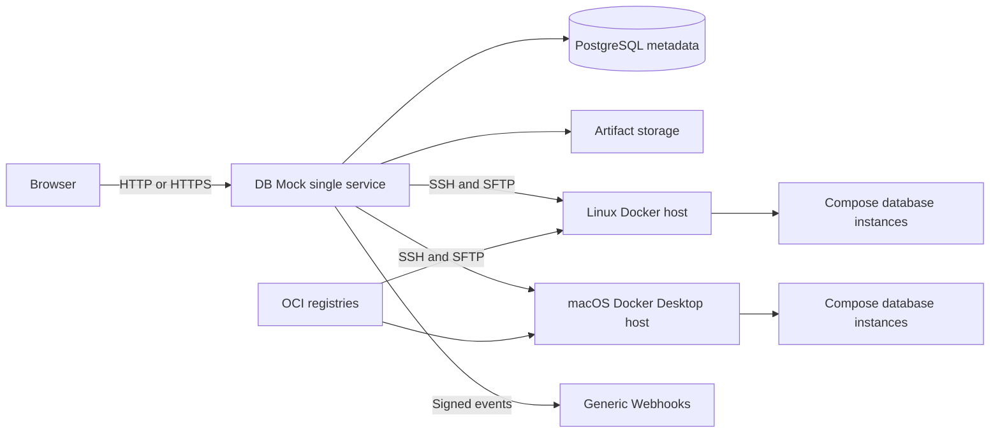
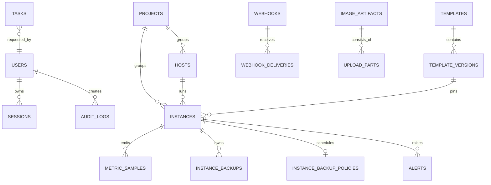
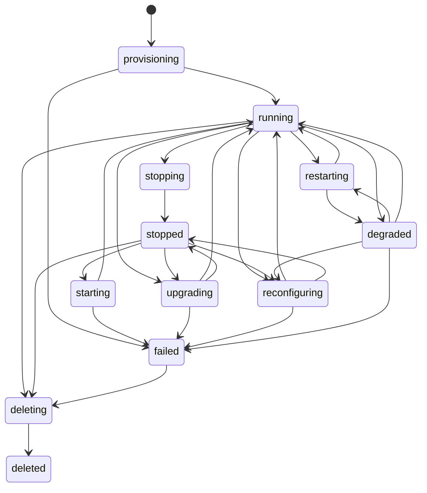

# DB Mock 技术架构

## 1. 总览


```mermaid
flowchart LR
    U["Browser"] -->|HTTP or HTTPS| A["DB Mock single service"]
    A --> P[(PostgreSQL metadata)]
    A --> F["Artifact storage"]
    A -->|SSH and SFTP| H1["Linux Docker host"]
    A -->|SSH and SFTP| H2["macOS Docker Desktop host"]
    H1 --> C1["Compose database instances"]
    H2 --> C2["Compose database instances"]
    A -->|Signed events| W["Generic Webhooks"]
    R["OCI registries"] --> H1
    R --> H2
```

应用采用模块化单体。一个 Go 进程提供页面、JSON API、会话、任务调度、监控采集、
Webhook 和 SSH 编排。React 构建产物通过 `go:embed` 编入同一个二进制。

## 2. 技术选型

- Go：HTTP、任务、加密、SSH/SFTP、Compose 编排。
- React + TypeScript + Vite + Ant Design：管理页面。
- PostgreSQL：事务元数据、任务、审计和短期指标历史。
- Docker Compose v2：控制平台部署及远程数据库实例运行。
- SSH/SFTP：无代理远程执行和文件传输。

不引入 Redis、消息队列、Nginx、Prometheus 或常驻远程 Agent，以符合 10 主机、50 实例
的规模并降低离线部署复杂度。

### 仓库边界

```text
backend/            Go 模块、cmd、internal、迁移和 web/embed
frontend/           React/Vite 源码与测试
deploy/             compose.yaml、docker/Dockerfile、环境模板和 TLS
scripts/            安装、升级、离线包和 CI 辅助脚本
docs/               产品与运维文档
```

Vite 将页面构建到 `backend/web/dist`，Go 服务从该目录嵌入静态资源。仓库根目录的
Makefile 是开发与部署的稳定入口；Go 与部署配置不会再与根目录文档混放。

## 3. 后端模块

| 模块 | 职责 |
|---|---|
| `api` | 路由、JSON、会话中间件、错误契约、静态资源 |
| `auth` | 初始化、登录、30 天会话、用户角色与会话管理 |
| `authorization` | 管理员、运维、只读三角色的服务端路由授权 |
| `crypto` | AES-256-GCM 密钥封装、Argon2id 密码哈希、HMAC |
| `store` | PostgreSQL 查询与事务边界 |
| `hostops` | SSH、SFTP、OS/资源探测、Docker 安装/升级、Registry CA |
| `templates` | 内置目录、自定义包校验、Compose 渲染和风险分析 |
| `instances` | 资源预留、端口分配和 Compose 生命周期状态机 |
| `tasks` | 持久化任务、阶段、日志、取消、重试和启动恢复 |
| `monitor` | 30 秒采集、状态协调、重启策略、告警生成和历史清理；实例样本中的磁盘指标表示其所在主机数据根目录的文件系统使用率 |
| `webhooks` | HMAC 事件、筛选、重试和投递记录 |

## 4. 数据模型

主要关系：


```mermaid
erDiagram
    USERS ||--o{ SESSIONS : owns
    USERS ||--o{ AUDIT_LOGS : creates
    PROJECTS ||--o{ HOSTS : groups
    PROJECTS ||--o{ INSTANCES : groups
    HOSTS ||--o{ INSTANCES : runs
    TEMPLATES ||--o{ TEMPLATE_VERSIONS : contains
    TEMPLATE_VERSIONS ||--o{ INSTANCES : pins
    INSTANCES ||--o{ METRIC_SAMPLES : emits
    INSTANCES ||--o{ INSTANCE_BACKUPS : owns
    INSTANCES ||--o| INSTANCE_BACKUP_POLICIES : schedules
    INSTANCES ||--o{ ALERTS : raises
    TASKS }o--|| USERS : requested_by
    WEBHOOKS ||--o{ WEBHOOK_DELIVERIES : receives
    IMAGE_ARTIFACTS ||--o{ UPLOAD_PARTS : consists_of
```

所有资源使用 UUID。数据库时间统一存 UTC，页面按系统设置中的 IANA 时区展示；
`DBMOCK_TIMEZONE` 只在首次创建平台账号前提供默认值，初始化后由 PostgreSQL 中的系统设置统一控制。
用户记录保存全局 `admin`、`operator` 或 `viewer` 角色。首个用户固定为管理员，新用户默认
只读；从无角色版本升级时，已有用户迁移为管理员以避免意外失去原访问能力。
软状态（容器状态、资源）由监控协调；用户意图（手动停止、自动重启开关）单独持久化，
避免监控错误拉起手动停止的实例。

## 5. 实例状态机


```mermaid
stateDiagram-v2
    [*] --> provisioning
    provisioning --> running
    provisioning --> failed
    running --> stopping
    stopping --> stopped
    stopped --> starting
    starting --> running
    starting --> failed
    running --> restarting
    degraded --> restarting
    restarting --> running
    restarting --> degraded
    running --> upgrading
    stopped --> upgrading
    upgrading --> running
    upgrading --> stopped
    upgrading --> failed
    running --> reconfiguring
    stopped --> reconfiguring
    degraded --> reconfiguring
    reconfiguring --> running
    reconfiguring --> stopped
    reconfiguring --> failed
    running --> degraded
    degraded --> running
    degraded --> failed
    running --> deleting
    stopped --> deleting
    failed --> deleting
    deleting --> deleted
```

任务阶段包含前置检查、资源/端口预留、镜像准备、宿主机调优、文件分发、Compose 执行、
健康检查和提交状态。删除采用显式 UUID 目录并验证目录属于主机配置的数据根，绝不使用
未解析变量或宽泛路径执行递归删除；Compose 项目未能确认停止时中止文件删除。

实例创建调度会同时检查平台内已有端口预留和目标 Linux/macOS 主机的实时 TCP 监听端口。
手动指定的冲突端口会在创建任务入队前拒绝；自动分配会跳过非 DB Mock 进程或容器占用的
端口，并在首选主机端口池无空闲时继续尝试其他兼容主机。
前端在资源步骤使用与服务端一致的 90% CPU、80% 内存、80% 磁盘调度阈值和平台内实例预留，
为每个架构及镜像兼容主机计算可调度容量。可承载候选展示部署后的预计余量；不可承载候选仍
保留在列表中，但按 CPU、内存、磁盘、端口范围或端口预留给出原因并禁止选择。自动推荐仍按
CPU 与内存余量比例排序，最终提交由服务端重新读取状态、探测真实 TCP 端口并完成权威校验，
因此页面预览不会替代并发安全或主机实时检查。
选择离线镜像时，调度器会先计算模板与镜像归档的架构交集，再执行主机容量、端口和实时
监听检查；自动选主机不会先选中镜像无法运行的架构。页面使用相同约束过滤主机和镜像，
并在进入确认步骤前重新校验所选镜像架构下仍有满足资源要求的目标主机。

创建流程因缺少兼容主机而转入主机接入时，前端只在内部相对 URL 中携带受白名单约束的
`/instances?create=1` 上下文；主机 ID 会在能力任务完成后的继续入口中加入该上下文。任务重试保留
同一继续地址。主机页重新加载模板、源实例和离线镜像数据，通过与实例创建页相同的模板架构及有效
离线镜像架构交集计算兼容主机；只有兼容的在线非维护主机才提供恢复入口和自动预选。主机能力探测
结果也使用同一要求校验，不兼容时保留检测结果用于排查，但禁用此次接入的保存动作。实例页重新加载
模板、主机、项目、镜像和仓库数据后才应用预选主机；离线、维护或架构不兼容的主机不会进入草稿。
该机制不保存凭据，也不改变实例创建接口的权限、实时调度和端口校验。

模板列表查询通过实例历史聚合每个固定版本的 `deploymentCount` 和 `lastDeployedAt`；聚合包含
已删除实例，使清理操作不会抹掉团队使用习惯。前端只从当前仍可新建、历史次数大于零的版本中按次数、
最近时间和稳定名称排序，展示前三项。该实现不新增用户偏好表、不读取凭据，也不绕过现有模板可用性、
架构、镜像、容量、端口或角色权限校验。

“复制部署”由前端将现有实例查询响应中的非敏感配置转换成普通创建草稿，不新增凭据读取
接口，也不复制数据库数据。转换显式清空实例名称、数据库密码、目标主机和宿主机端口，并在
当前目录、项目和镜像来源集合中重新验证引用。最终提交仍调用标准实例创建接口，因此权限、
实时容量与端口预留、任务持久化、审计、在线拉取和离线镜像流程保持一致。
实例列表与详情复用同一受信任的 `create=1&copy=<instance-id>` 内部入口；列表只在管理员或
运维可操作且源模板版本仍允许新建时开放快捷操作。只读角色不渲染入口，直接访问仍由标准创建
权限及来源、模板、主机和镜像重新校验约束。

项目生命周期默认值继续存储在 `projects` 元数据中，包含受限枚举的环境、0–365 天的使用周期和
字符串标签。模板与资源配置存储在一对一的 `project_deployment_profiles` 表中，包含固定
`template_version_id`、CPU、内存和磁盘；三项资源与模板成组写入或成组删除。项目删除级联清理
配置；模板版本删除只移除引用它的配置而保留项目，使后续创建安全回到模板选择。

项目创建和更新在同一事务中以 `FOR SHARE` 验证模板版本存在、仍允许新建且资源不低于模板
下限，再写入项目和配置。查询将模板名、版本、可用状态和资源规格作为非敏感字段展平返回。
接口沿用管理员/运维写权限并记录默认值变更审计；只读角色可查看。前端从项目入口创建时把有效
配置转换成标准实例草稿并跳过模板选择；模板失效或目录加载失败时保留项目上下文、回到模板步骤并
显示刷新或改选路径。凭据、目标主机、固定端口、数据库初始化参数和额外环境变量不进入项目配置；
最终提交仍执行现有权限、镜像、架构、实时容量、端口和主机在线校验。

批量生命周期入口调用受运维权限保护的 `POST /api/v1/instances/batch-actions/{start|stop|restart}`，
请求限制为 1–100 个唯一实例 ID。接口不把整批操作包装成一个共享事务，而是按输入顺序复用单实例
生命周期入队：每项都重新读取当前状态，并通过实例行锁、活动任务唯一索引及状态 compare-and-set
独立提交任务和中间态。这样并发状态变化只会成为该项的结构化拒绝结果，不会撤销已经安全入队的
其他任务。每个已接受项沿用原有任务、审计、取消、重试、主机串行和服务重启恢复语义；响应同时
返回 accepted/rejected 列表，前端只对已停止实例批量启动、只对运行中或异常实例批量停止或重启，
并将其他选中项在确认前标记为跳过。前端使用受读取权限保护的
`GET /api/v1/tasks?ids=<task-id,...>` 一次查询最多 100 个已接受任务并轮询到终态，不为批次创建父任务；
失败项继续复用任务故障分类、主机恢复和重试链路。批量删除不复用该入口，仍保留逐实例名称确认。

到期清理使用只读 `GET /api/v1/instances/{id}/cleanup-review` 聚合实例管理元数据、托管备份数量
和当前活动任务；`POST /api/v1/instances/{id}/cleanup-decision` 仅更新预计到期时间，支持从
“今天或原到期日的较晚者”延期 1–365 天或改为长期保留，并记录独立审计。前端只提供固定 7 天
快捷延期。`POST /api/v1/instances/batch-cleanup-decisions` 接受 1–100 个唯一实例 ID，并且只允许
`extend` 或 `retain`；它按输入顺序复用单项决定的并发防护，每项独立更新和记录审计，再返回
`updated/rejected` 逐项结果。前端在工作台预览每项新到期时间，成功项从选择中移除，失败项可单独
重试。该接口没有删除决定，永久删除继续调用现有实例删除任务入口并要求精确名称；创建删除任务的串行化事务先锁定
实例，再检查状态与任意托管备份，随后才关闭自动备份策略、写入任务和 `deleting` 状态。手动和
计划备份入队同样先锁实例，因此清理预检与最终提交之间新增的备份不会与删除同时成功。
实例详情的备份表保留完整元数据横向滚动，但将操作列固定在右侧，沿用实例列表和用户列表已有的
固定操作列模式；因此桌面和平板首屏能同时核对名称、状态和恢复/删除入口，不改变权限或任务接口。
备份创建、恢复和删除 API 已在服务端事务内串行检查状态、权限和活动引用；请求在任务创建前失败时
没有可追踪任务。前端因此沿用单实例生命周期请求失败模式，按稳定 API 错误码在确认弹窗和备份页
保留原因、影响与恢复建议。页面刷新实例、备份和任务清单后重新计算操作资格；安全重试只重新打开
原确认流程，恢复与删除会清空精确名称，不能从错误提示直接触发写操作。成功入队后转回标准任务通知、
轮询和失败恢复链路；服务端原权限中间件、行锁和事务仍是最终边界。
前端在删除入队后使用服务端返回的任务 ID 直接打开任务抽屉。成功处理器把实例名、主机、宿主端口、
绑定地址和 Compose/托管目录清理标记写入任务结果，使已删除实例从常规实例查询消失后仍有可审计回执；
任务资源解析对成功删除隐藏已失效的实例路径。失败任务保留实例记录及原任务上下文，继续复用主机恢复
和任务重试语义。

工作台 `GET /api/v1/dashboard` 的到期候选查询用同一条 SQL 关联托管备份计数和最新活动实例任务，
再通过共享的实例删除状态策略生成 `blockers` 与 `deleteReady`，避免为最多 50 个候选逐个请求预检。
这些字段是集中排查和只读可见性的依据；任何写操作仍重新调用单实例清理审查，永久删除仍执行事务内
最终检查，因此工作台快照不会被当成删除授权。

清理审查跳转到备份页时用查询参数保留本次清理意图。实例详情只在备份清单成功加载且为空、
同时活动任务清单成功加载并确认没有活动实例任务或处于创建、恢复、删除中的备份时开放“继续清理审查”；
任一清单请求失败都保持阻断并提供原地重试。该状态只用于续接工作流，最终删除资格仍由上述服务端审查和
入队事务判定。实例相关任务接口同时返回以实例为资源的任务，以及 payload 中关联该实例的备份任务；
数据库为任务的 `instanceId` payload 建立部分索引，避免逐备份请求和任务量增长后的全表扫描。清理引导
以每个备份最新的删除任务为准：失败、取消或中断时展示标准失败指导；主机类故障进入带原任务上下文的
主机恢复流程，其他故障可复用任务重试语义。重试排队后立即回到进行中状态，最终仍以备份清单为准。
任务中心对 `resource_type=backup` 的任务复用同一 payload 关联关系，将资源名称解析为对应实例，并生成
固定的实例备份清理路径；实例名称清单只负责增强显示，即使加载失败也不会移除任务自身可推导的入口。
旧任务缺少 `instanceId` 时保持不可跳转，避免根据备份 ID 或任意查询参数猜测资源。
实例详情只对失败、取消或中断的 `instance.create` 任务在恢复面板中增加清理审查入口；该入口复用现有
服务端清理预检和名称确认弹窗，不根据前端任务状态直接授权删除，也不向只读角色开放写操作入口。

生命周期任务入队与实例进入 `starting`、`stopping`、`restarting`、`upgrading`、
`reconfiguring` 或 `deleting` 中间态在同一个数据库事务内完成。监控器不会覆盖这些由任务持有的状态；
控制服务重启导致任务中断后，页面会保留重试入口。升级会记录操作前的期望状态：运行中
实例升级成功后继续运行，已停止实例只在校验和迁移期间临时启动，完成后恢复停止。
升级失败时先停止 Compose 项目，再恢复临时快照和原模板版本；自动恢复未完成时实例进入
`failed` 并产生严重告警，恢复成功也会保留警告告警供运维确认。
实例列表和详情的单实例启停入口在调用生命周期 API 前共用同一组状态、影响和中断说明；详情页确认
失败时保留弹窗内原因与恢复建议，关闭后转为页面级持久提示。状态刷新后不再允许原操作时禁用再次提交，
允许时也必须重新确认，避免从错误恢复入口绕过影响核对。服务端状态锁、权限和入队事务仍是最终边界。

升级和运行配置变更的“任务创建前失败”使用独立的前端请求状态，不与已经创建的任务失败混合。
API 拒绝后页面保留目标版本、镜像来源、资源和环境变量草稿，并重新读取实例、模板、主机、镜像、
仓库和任务清单。稳定错误码选择恢复建议，页面同时明确本次请求没有产生任务、停机、升级快照、
版本/镜像切换或运行配置变化。刷新发现活动任务时直接关联该任务并禁用提交；权限、资源不存在、
不允许的实例状态或失效升级目标同样禁止重试。只有当前证据仍满足同一操作时弹窗才允许再次确认，
成功返回任务后清除请求状态并复用标准任务进度、取消和执行失败恢复。服务端权限、串行化锁和活动
资源任务唯一索引仍是最终写边界。

运行配置变更在串行化事务中锁定实例与主机，排除实例原预留后校验 CPU 90%、内存 80%
和磁盘 80% 调度上限，并在创建任务时立即写入目标预留，防止并发创建或扩容超卖。主机
容量因实际使用而降低时，既有预留仍可原样保持或缩小，但不能继续增加超限的资源维度。
任务重新渲染并写入 Compose：运行中实例执行 `compose up --wait` 和健康检查，已停止实例
执行 `compose config --quiet` 且保持停止。任一步失败都会重写旧 Compose 并恢复旧元数据和
原期望状态；目标与旧环境配置只以 AES-GCM 密文保存在任务载荷中，审计仅记录资源差异和
环境配置是否变化。

主机运行参数更新使用串行化事务并锁定主机记录。存在活动任务时拒绝更新；数据根目录在
存在实例或备份时不可修改，端口池调整必须覆盖所有未删除实例当前使用的宿主机端口。
删除主机先锁定主机记录，并再次检查活动主机任务和未删除实例，避免与并发部署竞态。
删除成功后，已删除实例保留为不再指向主机的历史记录，任务的主机引用按外键置空；实例目录
已随实例删除而清理，因此依赖该主机的备份元数据同时删除，不再阻断主机连接清理。

## 6. SSH 与命令安全

身份验证中间件先从服务端会话解析当前用户及最新角色，再由路由授权中间件执行权限判断：
用户和系统设置管理仅限管理员；资源变更、任务操作、凭据读取、Webhook 和审计读取限管理员
及运维；只读角色只能调用非敏感查询。角色变更与禁用会删除目标账号的全部会话。最后一个
可用管理员校验与更新在同一数据库事务和顾问锁内完成，避免并发降级或禁用留下无管理员状态。
所有已登录角色都可通过独立的个人账号接口更新显示名称与语言偏好。自助修改密码先对当前
密码执行 Argon2id 校验，再以请求开始时读取的旧哈希作为 compare-and-swap 条件更新数据库；
因此并发修改只有一个成功。提交密码更新的事务同时删除除当前会话外的其他会话，审计只记录
密码已变更和会话已撤销，不记录当前密码、新密码或其哈希。

- 只允许直连 SSH；保存并校验主机指纹，指纹变化将阻止自动操作。
- 连接测试由服务端签发 10 分钟有效的加密验证凭证，绑定主机范围、连接参数、认证凭据
  摘要、数据根目录、端口池和实际指纹；新增主机和敏感运行参数修改必须提交匹配凭证。
- 主机探测会验证数据根目录可写，并通过 `ss`、`lsof` 或 `netstat` 识别端口池中的首个
  空闲端口。探测能力缺失、目录不可写或端口池耗尽都会在保存前明确显示。
- 密码、私钥、仓库凭据和数据库密码在入库前使用 AES-256-GCM 加密。
- 运行配置任务为可重试和失败恢复保留的环境变量快照同样使用 AES-256-GCM 加密，任务 API
  和历史记录只暴露密文；审计不记录环境变量名称或值。
- 主密钥来自环境变量或 Docker Secret，不进入数据库。
- 命令参数使用严格校验及 POSIX/PowerShell 不相关的 Linux/macOS shell 转义。
- Docker 安装/升级、CA 安装和宿主机调优必须是显式任务并完整审计。
- 更新操作的审计记录保存结构化前后差异；密码、Token、私钥、主机指纹、代理凭据和
  Webhook 查询参数不写入差异，只记录是否配置或是否变更。日志层再统一执行递归脱敏，
  前端展示时执行第二层脱敏。

## 7. Compose 项目布局

远程主机默认目录：

```text
<data-root>/
  instances/<instance-uuid>/
    compose.yaml
    .env                 # 0600
    .dbmock-managed-files # 0600，当前模板版本拥有的附加文件清单
    config/
    data/
    runtime/
  backups/<instance-uuid>/
    <backup-uuid>.tar.gz  # 0600，主机本地冷备份
  backups/.rollback/
    <instance-uuid>/
      <operation-uuid>.tar.gz  # 仅对应升级或恢复操作链的回滚期间存在
```

Compose 项目名为 `dbmock_<uuid-without-dashes>`。容器使用 `dbmock.instance`、
`dbmock.template`、`dbmock.project` 标签。平台删除时只清理这一受管目录；自定义模板中
指向目录外的绑定挂载仅停止使用，不删除源文件。

实例目录中的 `.env` 仅供 Compose 插值，不会自动成为容器环境。内置单容器模板会把
连接账号、密码和数据库名分别注入保留变量 `DBMOCK_DB_USERNAME`、
`DBMOCK_DB_PASSWORD`、`DBMOCK_DB_NAME`，健康检查只读取这些容器内变量。用户追加环境
变量不能覆盖这三个保留名称，避免健康检查凭据和实际实例凭据发生漂移。

模板不可变清单保存 `authentication`：`password` 表示用户名和平台管理密码，`username`
表示只使用用户名，`none` 表示不使用数据库凭据。实例创建、密码加密、连接 URI、环境变量片段和交付
摘要都从同一模式派生，避免向使用方交付容器未配置的密码。为兼容升级前已经保存且不会被启动同步改写的
内置版本，Cassandra 回退为 `none`，TiDB、StarRocks 和 Doris 回退为 `username`，其他未声明版本
回退为 `password`。无密码模式在页面明确提示仅用于受控测试网络；网络隔离和主机防火墙仍是部署边界。

自定义模板版本可声明非敏感的结构化参数和资源预设。参数值按不可变版本的类型、必填项、
数值范围或候选项校验，独立保存于实例配置，再以带引号的容器环境变量合并到 Compose；参数
环境名与高级环境变量冲突时拒绝操作。模板上传会用逐参数探针值实际渲染 Compose，并确认
占位符位于服务的 `environment` 映射内。版本升级保留同键参数、移除目标版本已删除的参数并
应用新默认值；目标版本新增无默认值的必填参数时，在任务入队前拒绝升级。参数不是密钥容器，
不得承载密码、令牌或私钥。

自定义模板不能提供 `.env`、额外的运行时 `compose.yaml`、`data/`、`runtime/` 或内部受管清单
路径。包内附加配置与脚本在上传时完成规范化、大小写碰撞和文件/子路径冲突校验；声明的
Compose 源文件只用于渲染，不作为附加文件复制。每次写入项目时，平台先用
`.dbmock-managed-files` 计算当前版本与
上一版本的路径差异，只删除上一版本明确拥有且目标版本已移除的普通文件，并只移除随之变空
的父目录。升级前快照和回滚写入执行反向收敛，`data/` 及未列入清单的运行时文件不参与清理。
旧版本平台保存的模板包如果包含保留路径，读取时会忽略该路径，避免升级兼容性被安全校验阻断。

手动备份是对整个受管实例目录的停机 tar/gzip 归档，因此包含数据、Compose 配置和
`.env` 凭据。归档目录与文件分别限制为 `0700` 和 `0600`，API 不返回远程路径，任务和
审计日志也不记录归档内容。归档流由实例当前镜像中的 `/bin/sh` 与 `tar` 生成或恢复，
临时容器禁用网络、根文件系统只读并使用 `--pull never`，从而既能访问数据库 UID 持有的
文件，也不会破坏离线语义。这种本地副本可防止误操作与升级回归，不能代替跨主机灾备。

自动备份策略按实例保存每日/每周频率、当地执行时刻、IANA 时区、保留份数和下一次 UTC
执行时间。轻量调度器每 30 秒扫描到期策略；入队事务先锁实例再锁策略，同时创建计划备份、
实例任务、`backing_up` 状态并推进下一次执行时间。实例忙碌时事务不写任何部分状态，策略
保持到期并在后续扫描补跑。任务执行前后记录策略最近任务与结果；成功后重新读取当前策略，
只为超出保留数的 `scheduled` 备份创建删除任务，`manual` 备份不参与自动清理。

## 8. 任务一致性

- API 在同一个串行化数据库事务中创建实例资源意图、端口与容量预留和对应任务，HTTP
  只在两者都提交后返回 `202 Accepted`；任务写入失败会回滚实例，不会留下没有执行任务的
  `provisioning` 记录。创建任务持久化所选离线镜像或仓库引用，并与实例配置相互校验。
- 前端把创建请求失败分为“收到服务端拒绝”和“未收到确认”两类。收到稳定 API 错误后保留草稿，
  并并行刷新实例、模板、主机、项目、离线镜像和仓库；实例清单用于识别同名资源，其他结果重新
  计算模板可用性、主机状态、容量、端口和镜像兼容性。只有拒绝结果确定、相关读取完整、未发现
  同名实例且草稿仍有效时才重新开放原创建按钮。权限、资源不存在、参数无效或网络结果不确定时
  保持禁用，通过返回对应向导步骤、打开同名实例或再次刷新提供恢复路径。服务端事务与唯一约束
  继续作为最终防重和一致性边界；前端不从错误提示直接发起写操作。
- 创建表单以模板版本 ID 记录模板字段是否已经初始化。模板、项目或主机对象因上下文刷新而获得
  新对象身份时，只重新计算兼容性与重试资格，不再次写入模板或项目默认值；用户的资源覆盖、
  数据库访问选项和初始化参数因此持续保留。只有模板版本 ID 真正改变、复制草稿首次应用或用户
  明确应用项目部署配置时才写入相关默认值。失效主机、离线镜像或仓库仍由独立兼容性校验清除，
  不影响其他有效字段。
- 前端只为 `instance.create` / `instance_create` 且 `resource_type=instance`、资源 ID 完整的任务
  派生部署续接地址，不接受任务内容或 URL 参数提供的任意返回地址。排队、执行和重试状态指向实例
  进度，成功状态指向连接信息，其他终态指向实例恢复上下文；管理员和运维才显示连接交付入口，
  只读角色只进入实例状态。连接页仍通过服务端凭据权限和审计接口揭示密码，任务 API 和续接地址
  都不携带凭据。前端仅从已经加载的实例与项目响应派生项目、环境、用途、负责人和预计到期时间，
  在凭据门禁外展示这组非敏感交付上下文；复制完整交付摘要时才将它与经授权读取的连接响应组合，
  不把密码、URI 或 JDBC 写入实例、项目或任务状态。
- 实例详情根据创建任务的稳定阶段映射展示下一项平台自动动作；未知阶段安全回退为当前任务消息，
  不猜测完成时间。页面直接复用任务取消接口与服务端 `cancelable` / `cancel_asked` 状态，管理员和
  运维可在原页发起一次安全取消，只读角色无写入口。取消请求失败保留常驻错误且不伪造任务变化，
  请求已接受后立即关闭重复入口并等待任务轮询收敛。
- 工作器使用 `FOR UPDATE SKIP LOCKED` 领取任务，并跳过已经存在运行任务的主机，避免忙主机
  的队首任务阻塞其他空闲主机。选中队列行后，事务锁定对应主机记录并重新检查运行任务，
  防止多个工作器同时看到空闲状态后并发启动同一主机上的任务。
- 同一主机的破坏性 Compose 任务严格串行执行；不同主机可以并行。
- 备份创建、恢复和删除与实例生命周期任务共用同一主机串行约束。恢复入队时锁定
  实例与备份记录，并在同一事务内进入 `restoring`，防止并发删除或其他实例操作。
- 恢复处理器在失败收尾完成后通过受控错误附加非敏感 `restoreOutcome`、实例状态和期望状态；
  任务管理器仍按原始错误分类和重试，但会把该结构写入失败任务的 `result`，因此任务详情、
  Webhook 和实例页使用同一份持久化回滚结论。`pre_restore_recovered` 表示目标备份未生效且
  操作前数据已恢复，`rollback_incomplete` 表示数据状态不可确认并阻止交付。若实例状态写回
  失败，同样按回滚未完成处理；历史任务没有结果时只接受实例稳定状态消息作为兼容证据。
- 成功恢复返回 `target_backup_applied`，并把目标备份 ID、名称、创建时间、SHA-256、健康验证
  时间、实例状态和期望状态写入任务 `result`。这些字段不包含凭据，可安全进入任务 API 与
  Webhook；即使备份记录随后删除，恢复任务仍保留可审计的数据版本证据。实例页从按时间倒序
  的实例相关任务中选择最近一次恢复，而非最近一次任意生命周期任务，因此普通启停或重启不会
  抹去当前数据来源；新的恢复尝试会自然替换旧结论。
- 自动备份到期入队锁定实例与策略，并与 `backing_up` 状态、备份元数据、任务和下次执行
  时间在同一事务提交；删除实例的事务会同时关闭计划，避免删除与调度竞态。
- 运行配置变更的任务、目标资源预留、自动重启策略与 `reconfiguring` 状态在同一事务写入；
  失败恢复和成功提交都同时更新资源、配置、重启策略、稳定状态及期望状态。已停止实例只
  校验新 Compose，之后的手动启动使用 `docker compose up` 协调已保存配置，不复用陈旧容器参数。
- 每个阶段设计为可重试或可检测已完成。收到正常停止信号后，工作器先完成实例恢复逻辑，
  再使用独立且有时限的数据库上下文把运行中任务写为 `interrupted/application_stopped`；
  Compose 为这段收尾保留 4 分钟，用户主动取消仍记为 `canceled`。进程意外退出时，下一次
  启动将遗留运行任务写为 `interrupted/application_restarted`，两种中断都允许用户重试。
  工作器保留脱敏原始错误作为技术详情，同时把受控基础设施错误归为稳定 `error_code`：
  SSH 不可达、凭据拒绝、主机指纹变化、超时、镜像拉取失败、主机磁盘不足、Docker 数据路径未共享、端口冲突和
  健康检查失败。前端只依赖稳定代码生成原因与恢复建议，未知错误回退为通用说明，不根据
  环境相关原始文本决定交互。
- 工作台的待处理事项先按 `(resource_type, resource_id)` 选取最新任务，只保留现存资源的
  `failed` / `interrupted` 状态，再补充当前为 `failed` / `degraded` 且未被上述任务代表的实例。
  因此后续重试已排队、操作成功或资源删除会抑制旧失败；原始错误文本仍只在受控任务详情中展示，
  工作台仅返回稳定错误代码和资源上下文。
- 主机类故障入口使用 `/hosts?host=<host-id>&recoveryTask=<task-id>` 保存恢复上下文。前端重新从
  任务 API 读取资源、主机和状态，不信任调用方提供资源路径，也不携带任意返回 URL；任务的
  `host_id`（主机任务使用资源 ID）必须与当前主机一致才开放重新检测或重试。主机和任务分别按
  现有轮询刷新，主机在线、非维护且无主机操作时才开放原任务重试。重试继续调用标准任务 API，
  并把查询参数替换为新任务 ID，因此刷新后仍跟踪新任务；成功后返回路径由任务资源类型和资源 ID
  推导。需要主机恢复的稳定错误在工作台、实例面板和任务抽屉中不再同时提供直接重试，避免用户在
  主机仍不可用时反复创建必然失败的任务。任务列表直接从任务的 `host_id`（主机任务可回退到资源 ID）
  推导恢复入口，因此即使主机名称辅助请求暂时失败也不会退回直接重试。只读角色可使用这一只读导航，
  但恢复页不渲染重新检测或重试等写操作，服务端运维权限仍是最终边界。
- 实例恢复确认把成功任务与当前实例健康状态分开核对。仅当实例为 `running` 时开放连接交付；
  `stopped` 保留预期停止说明；当实例为 `degraded`、期望状态为 `running` 且稳定状态消息为
  `Container health check is starting` 时，前端把它识别为健康收敛阶段，显示自动刷新和手动刷新入口，
  但不显示凭据交付入口。其他异常状态继续进入日志与任务排障路径，避免用成功任务掩盖真实故障。
  升级与恢复快照按稳定的操作链 ID 隔离：中断重试复用原始
  完整快照，不会用可能已部分修改的数据覆盖它；普通失败或取消后的重试则重新创建快照。
  升级元数据已经提交但任务尚未写回成功时，重试只收敛稳定状态并清理该操作快照。
- 任务中心、工作台、实例详情和主机恢复页通过同一个客户端状态机，把“原任务执行失败”和“重试请求
  未确认入队”作为两个状态处理。重试请求失败后读取
  未受页面筛选限制的任务清单，以原任务 payload 的 `operationId`（缺失时回退原任务 ID）、
  相同任务类型、资源和请求时间识别后继任务；找到后直接切换到后继任务。没有后继任务时检查
  同一资源的 `queued`、`running` 或 `retrying` 任务并作为阻塞证据展示。稳定服务端拒绝可确认
  本次没有新任务；网络结果不确定时必须完成两次成功证据读取后才可能重新开放重试。权限、对象、
  参数和任务状态错误始终阻断。共享展示组件统一原因、影响、恢复建议、错误码和阻塞任务；各页面只负责
  保留自己的任务、实例或主机导航上下文。该客户端证据门只防止误重复提交，不替代服务端权限、任务
  行锁、活动任务唯一索引或事务写入。
- 取消请求只在任务当前阶段标记为可取消时由数据库接受。阶段切换与取消标记通过同一任务行
  原子串行化：已经接受的请求会在下一次外部副作用前停止任务并恢复实例或备份的稳定状态；
  工作器先进入不可取消阶段时，后到的取消请求返回冲突，不会打断删除、迁移或数据恢复。
- 尚未领取的排队任务会在取消请求事务内直接完成为 `canceled`，同时恢复实例状态、运行配置
  预留、备份状态和自动备份最近结果，不需要等待同一主机前面的长任务结束。删除任务入队时
  会保存被暂停计划的启用状态和下次执行时间；执行前取消会原样恢复。排队中的重试尚未修改
  资源，取消时保留当前资源状态，不会回退到原始失败任务的旧快照。运行中任务仍只在安全
  检查点响应取消。
- 审计记录与任务 ID 关联。

## 9. 监控与重启

监控器每 30 秒按主机并发执行一次轻量 SSH 批处理，采集 Docker info、磁盘与所有受管
Compose 容器的进程状态及 Docker Health，避免为每个容器单独建立连接。一个实例包含
多个容器时按最差状态聚合：部分容器退出或任一健康检查失败都会把实例标记为
`degraded`。`starting` 仅作为启动过渡态，Docker 明确报告 `unhealthy` 后才创建健康告警。
指标批量入库，7 天后清理。

采集间隔、指标保留天数和磁盘警告/严重阈值通过系统设置中的结构化表单管理，保存后在
下一轮监控生效。每种默认告警都有独立开关；关闭开关只抑制后续新告警，不删除既有
事件记录。普通 SSH 网络故障连续 3 次后产生主机离线告警，服务端明确拒绝密码或私钥时
立即产生独立的 `ssh_credential_invalid` 告警，避免把凭据轮换问题误诊为网络抖动。

自动重启开启时渲染 Compose `restart: unless-stopped`，关闭时显式渲染 `restart: "no"`，
同时使用控制面失败计数。策略变更与 CPU、内存、环境变量共用可恢复的运行配置任务，避免
页面状态与实际容器策略分离。用户手动停止会设置 `desired_state=stopped`；监控器只在
`desired_state=running` 且实例开关启用时补偿。容器重新健康后，退出、健康检查和重启失败
告警由系统自动解决。
升级失败告警包含失败任务、原版本、目标版本和自动恢复结果；后续升级成功后由系统自动解决。

告警状态转换保存确认人与解决人，自动恢复由 `system` 标识。Webhook 投递使用持久化
队列和 `FOR UPDATE SKIP LOCKED` 领取：业务事件最多尝试 5 次，测试请求只尝试 1 次；
禁用 Webhook 会取消待发记录，进程重启后超过 1 分钟的 `sending` 记录会恢复为待重试
或在目标已禁用时取消。HTTP 客户端不跟随重定向，避免将签名载荷发送到意外地址。

## 10. 镜像上传与分发

浏览器按系统设置中的分片大小顺序上传，服务端按上传 ID 保存已接收偏移和临时文件，
中断后从最后确认的偏移继续。运行时单文件上限不能超过部署变量
`DBMOCK_MAX_UPLOAD_BYTES` 指定的硬上限；修改策略只影响新建上传任务，无需重启服务。
未完成的上传会话和临时分片保留 7 天；服务启动时立即清理过期数据，之后每小时巡检一次。
完成上传后遗留的会话元数据采用相同周期回收，不影响已经入库的镜像归档。
完成后校验 SHA-256、解析 Docker/OCI manifest、记录镜像引用和平台架构。相同摘要只保留
一份；重复上传不会改变镜像的最近使用时间。

分发使用 SFTP 从已传字节继续，完成后在远端执行 `docker load` 并删除临时文件。任务
日志只记录摘要、大小和进度，不记录凭据。只有 `docker load` 成功后才更新控制端归档的
最近使用时间。

实例升级与创建使用相同的镜像来源模型：直接拉取、匹配模板镜像域名的仓库凭据，或
同时包含目标模板全部 Compose 服务镜像引用并支持实例主机架构的离线归档。模板入库时
先渲染并固化完整镜像集合；直接拉取逐个准备全部镜像，私有仓库只有在所有引用属于同一
仓库域名时才可选择。来源选择在任务入队前校验并写入
任务载荷；任务运行时重新校验，成功后与模板版本在同一条数据库更新中写回实例配置，
失败恢复则保留旧版本和旧来源。离线归档传输继续使用任务进度，并在 `docker load` 成功
后记录最近使用时间。

未使用镜像扫描按“没有被未删除实例引用，且最后分发时间（从未分发则使用上传时间）早于
指定阈值”筛选。清理只由登录用户手动触发，提交清理时在数据库事务中重新锁定镜像并
校验引用和时间，避免与并发创建实例发生竞态；只删除控制端归档，不删除主机镜像。
扫描和删除也会排除被排队或运行中的实例升级任务引用的镜像；任务入队与镜像/仓库删除
通过行锁和持久化任务引用串行化，任务重试时再次取得相同保护。

自定义模板使用只追加版本模型：已存在的 `slug + version` 不能覆盖，内置模板 slug 也
不能被自定义包占用。模板元数据和新版本在同一事务内写入，并发重复上传只有一个能够
成功；数据库写入失败时移除本次暂存包。删除没有活动实例引用的自定义模板后，控制端会
一并清理其所有版本 ZIP。模板删除会先锁定全部版本，并拒绝仍被当前或历史实例引用的
模板，避免与并发实例创建发生竞态。内置模板启动同步同样不会改写已经保存的版本内容，
模板实现有变化时必须使用新的版本标识。

## 11. API 与前端

JSON API 使用 `/api/v1`，统一错误格式：

```json
{
  "error": {
    "code": "resource_conflict",
    "message": "port 23306 is already reserved",
    "details": {}
  },
  "requestId": "..."
}
```

API 是同源页面的内部接口，不承诺第三方兼容性。状态改变请求进行 Origin/CSRF 检查，
登录 Cookie 不对 JavaScript 开放。任务详情使用短轮询或 SSE 展示增量日志。

前端 API 客户端把任意 `401 Unauthorized` 统一提升为会话失效事件。认证上下文收到事件后
立即清除当前用户，使 React 卸载实例连接凭据、日志等已认证页面，并在登录页说明账号状态
或密码可能已经变化。错误密码导致的登录 `401` 发生时本地本来就没有已认证用户，因此仍只
显示登录错误，不会误报为被撤销的既有会话。实例连接页单独保存凭据读取错误：首次揭示失败时
使用常驻错误状态和原地重试代替瞬时通知；已揭示凭据的刷新失败不会清空当前显示值，但会持续
标记刷新未完成。离开连接标签页时，明文凭据与读取错误同时从 React 状态清除。
实例详情对启动、停止和重启的“任务创建前失败”保存独立的常驻请求错误状态：API 稳定错误码决定
恢复文案，原始本地化错误作为原因展示；页面立即重新加载实例与任务状态，提供日志、刷新和条件化
重试入口。只有刷新后的实例状态仍允许同一操作且错误不是权限或资源不存在时才开放重试；任一
生命周期任务成功入队后清除该状态，避免与标准任务进度或任务失败恢复面板重复。
升级与运行配置变更沿用相同的常驻请求恢复原则，但同时保留原表单草稿并刷新模板、主机和镜像来源；
表单会根据最新活动任务、权限、实例状态和目标版本重新计算提交资格。关闭弹窗后错误转为实例页提示，
再次打开仍须经过原表单确认，不从错误提示直接创建任务。
主机故障恢复面板同样使用常驻错误状态处理任务读取、轮询和重试请求失败；已有任务内容不会因一次
轮询失败被清空。主机详情中的普通重新检测按钮在恢复上下文有效期间由面板接管，避免同一抽屉出现
两个同名主操作。

## 12. 部署与升级

控制平台 Compose 文件位于 `deploy/compose.yaml`，本地配置位于被 Git 忽略的
`deploy/.env`。Compose 服务：

- `dbmock`：应用、静态页面、任务与监控。
- `postgres`：平台元数据。

所有带类型的进程级环境变量在创建目录、连接 PostgreSQL 和启动后台任务前严格解析并做范围
校验。公开地址被规范化为不含路径的 HTTP/HTTPS origin；内置 TLS 要求 HTTPS 公开地址并在
启动前加载证书和私钥。会话 Cookie 的 Secure 属性和 HSTS 由浏览器公开地址是否为 HTTPS
决定，因此 TLS 在同一 Go 服务或受控反向代理处终止时保持一致。镜像健康检查和灾备恢复
探针根据证书配置选择内部 HTTP 或 HTTPS，避免内置 TLS 被误判为服务不可用。

客户端来源地址在最外层请求中间件解析一次并写入请求上下文，认证会话、审计和结构化请求
日志复用同一结果。默认只使用 TCP 直连方；只有直连方命中 `DBMOCK_TRUSTED_PROXIES` 的
IP/CIDR 时才读取 `X-Forwarded-For`，并从右向左跨过连续可信代理。畸形或超过 32 跳的链
回退到直连方，从而避免公网请求自行伪造审计来源。

控制平面备份先停止 `dbmock` 服务以冻结写入，保持 PostgreSQL 运行并生成 custom-format
逻辑转储，同时从应用数据卷流式归档主密钥和上传制品。清单分别记录数据库和应用数据的
SHA-256；最终文件权限为 `0600`，配置口令文件时再使用 AES-256-CBC、PBKDF2 和随机盐加密。
口令不进入归档。

恢复只接受结构完整且校验和匹配的归档。覆盖当前状态前会自动创建一次安全备份；数据库
采用删除并重建目标库后 `pg_restore`，应用卷会先清空再解包，确保恢复后新增对象不会残留。
当前版本应用启动并通过健康检查后才算成功，否则自动用安全备份恢复数据库和应用卷。

升级通过替换应用镜像并执行向前数据库迁移。在线和离线升级脚本默认在拉起新版本前创建
控制平面备份；只有显式设置 `DBMOCK_SKIP_PRE_UPGRADE_BACKUP=true` 才能跳过。破坏性迁移
不允许进入首版。

## 13. 测试策略

- 单元：加密、密码、转义、模板渲染、资源调度、端口、状态机、Webhook 签名。
- 存储：临时 PostgreSQL 下的迁移、事务与并发任务领取。
- SSH/Docker：协议级 fake server 与命令快照；Linux x86 实机作为发布验收。
- 前端：组件测试、API mock、关键创建/启停/删除流程的 Playwright。
- 构建：前端产物嵌入 Go、Compose 启动、健康检查、多架构镜像。

主分支 CI 使用 Buildx 与 QEMU 构建并校验 `linux/amd64`、`linux/arm64` OCI 索引。版本标签
发布带来源标签、provenance 和 SBOM 的 GHCR 多架构镜像，并为两种架构分别生成经过校验的
离线安装包；GitHub Release 同时发布所有离线包的顶层 `SHA256SUMS`。独立的定时工作流
每周读取内置模板目录，远程校验所有数据库镜像标签及其声明的平台仍然可用。

后端命令从 `backend/` 运行，前端命令从 `frontend/` 运行；GitHub Actions 将后端、
前端、Compose E2E、多架构交付验证和漏洞扫描拆成五个独立 job。
